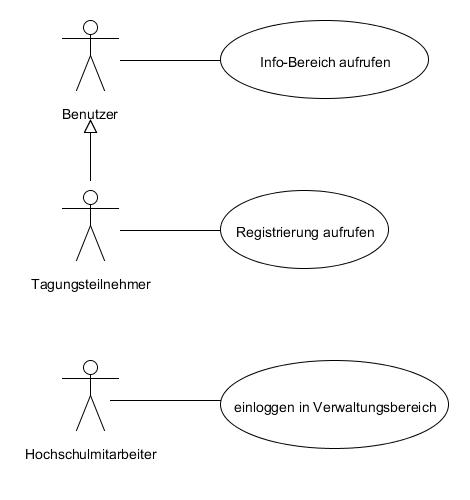
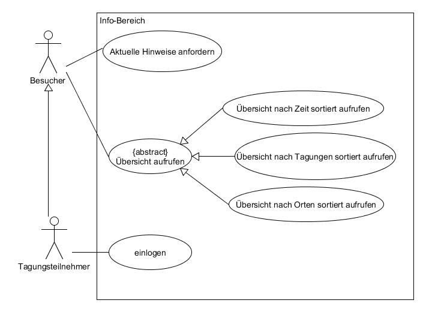

---
title:
   main: Software Engineering
   sub1: Praktikum Gruppe B
   sub2: Pflichtenheft
rtext:
   main: Bachelor-Studiengang Informatik
   sub1: WS 2014 / 2015
   sub2:
author:
   name1: Cristea, Liviu, 879401
   name2: Hensel, Simon, 880997
   name3: Wewering, Lukas, 880680
revision:
   level: 1.0 
   date: 29.10.2014
lang: de
cssextra: ph.css
---

# Zielbestimmung

Es soll ein Informationssystem für Tagungen entwickelt werden.

Dabei müssen drei Hauptbereichte berücksichtigt werden:

##Informationen
Der erste Bereich ist der Info-Bereich, der den Besuchern der Webseite sowie auch den Teilnehmern bzw. den registrierten Benutzern des Systems zur Verfügung stehen soll. Der Info-Bereich muss beinhalten: 

* eine Übersicht über das gesamte Tagungsangebot
* die Erstellung individueller Tagungsprogramme
* eine Seite mit aktuellen Hinweisen, beispielsweise Terminänderungen etc.

##Registrierung
Der zweite Bereich ist der Registrierungsbereich für die Teilnehmer. Dieser soll es ermöglichen, dass sich die Teilnehmer eine Übersicht über die angebotenen Leistungen verschaffen und diese auch buchen können. Desweiteren ist es auch wichtig, dass sie spezielle Hinweise zu den angebotenen Leistungen sehen können, diese sind z.B. Änderung der Dauer der Tagung usw. 

##Verwaltung
Der letzte der drei Bereiche ist der Verwaltungsbereich. Dieser ist für die Betreiber der Seite vorgesehen. Dafür muss zwingend eine Zugangsberechtigungen bestehen, ebenfalls muss es möglich sein, dass Anmeldungen/Registrierungen bestätigt und verwaltet werden. 
Der Bereich ist ebenfalls zuständig für die Verwaltung von Buchungen und Zahlungen. 

Zuletzt muss das Erstellen und Ändern des Tagesprogramms selber bewerkstelligt werden können. Dabei sind folgende Möglichkeiten zu implementieren:

-  Tagungseinheiten(Sessions, Workshops) verwalten
-  Beiträge zu den Tagungen verwalten
-  Verwaltung der  Redner/Autoren
-  Raumverwaltung für die Tagungen
-  Verwaltung des Zeitplans.

# Produkt-Einsatz    

## Anwendungsbereiche
Das Produkt soll an der Hochschule Niederrhein als Informationssystem für Tagungen eingesetzt werden. Das Produkt wird als Web-Applikation genutzt und lässt sich über den Web-Browser betrachten.   
Die Benutzer der Seite sollen einen Überblick über das Tagungsprogramm bekommen.   
Es soll auch die Verwaltung der Teinehmer einer Tagung einschließlich der zu beachtenden Buchungen und Gebühren gewährleistet sein. 

## Zielgruppen
Die Benutzer der Seite sind Personen im mittleren Alter sowie auch evtl. Studenten, die fortgeschrittenere Kenntnisse im Bereich der Webseitennutzung haben. Die Betreiber der Webseite an der Hochschule haben sehr fortgeschrittene Kenntnisse in der Nutzung von Online-Verwaltungs-Systemen und Informationssystemen dieser Art.

Es werden verschiedene Rollen für die Applikation Vorgesehen:

> - **Besucher:** Kann sich im Info-Bereich die angebotenen Tagungsprogramme ansehen und sich auch unverbindlich ein eigenes Tagungsprogramm zusammenstellen.
> - **Registrierter Benutzer:** Hat die gleichen Möglichkeiten wie der Besucher, mit dem Zusatz dass er spezielle Hinweise und Leistungen sehen und Leistungen buchen kann.
> - **Verwaltungsbereich:** Möglichkeit, das Tagungsprogramm und alles, was damit zusammenhängt, zu bearbeiten, Registrierungen von Tagungsteilnehmern zu bestätigen und zu verwalten sowie Buchungen, Zahlungen und Forderungen zu verwalten.

## Betriebsbedingungen
In normalem Betrieb ist nicht mit außergewöhnlichen Betriebsbedingungen zu rechnen. Dies ändert sich in den Phasen, wo sehr viele Tagungen angeboten werden, da die Nachfrage sehr groß ist. Dies kann dazu führen, dass der Server überlastet wird. Daher ist vorrauszusetzten, dass der Server sowie auch die Software eine große Anzahl an Anfragen verarbeiten kann.

# Produkt-Umgebung
Die Software wird als Web-Applikation eingesetzt, welche auf einem Web-Server zur Verfügung gestellt werden muss.   
Weiter muss eine Schnittstelle zu den Bankservern sowie diversen anderen Bezahldiensten implementiert und bereitgestellt werden.

## Software
Als Software zwingend notwendig ist ein Web-Client (Browser).

Weiterhin wird ein Datenbanksystem benötigt, um das Tagungsprogramm, die Tagungsteilnehmer und die Buchungen zu verwalten und über Abfragen schneller an die Daten zu kommen. Für das Datenbanksystem muss eine Schnittstelle zur Web-Applikation bereitgestellt werden, damit Datensätze eingefügt, abgefragt und ausgewertet werden können.

## Hardware
Der Nutzer benötigt zum Aufruf der Webseite einen PC oder alternativ ein mobiles Endgerät.   
Für den Betrieb der Applikation wird ein Web-Server benötigt, der entsprechend konfiguriert und über eine festgelegte URL erreichbar ist.

# Funktionale Produkt-Anforderungen

Die Software soll den Besuchern und Tagungsteilnehmern eine bequeme und schnelle Übersicht über das Angebot der Betreiber zu Verschaffen.   
Es soll ebenso den Verwaltern der Tagungen eine schnelle Übersicht über die anstehenden Tagungen, inkl.Teilnehmern und Rednern, verschaffen und ebenso eine schnelle Auswertung der Zahlungen und Forderungen die getätigt wurden oder noch offen sind.

## Anwendungsfälle

Die Startseite bietet dem Benutzer, je nach Absicht auf die Entsprechende Seite zu wechseln. Dieser Use-Case ist für die implementierung nicht stark von Bewandnis und dient hier nur der verdeutlichung der Benutzer Rollen.

Der Info-Bereich, welcher für den Besucher und Tagungsteilnehmer konzipiert ist, bietet eine vielseitige Möglichkeit sich über Tagungen zu informieren und auch bei Bedarf sich aktuelle Hinweise geben zu lassen. Der Tagungsteilnehmer erbt hierbei die Informationsmöglichkeiten des normalen Benutzer, hat aber darüber hinaus noch die möglichkeit sich für Tagungen per Online-Anmeldung anzumelden.

Durch den Registrierungsbereich hat der Tagungsteilnehmer die Möglichkeit sich zu registrieren und eine Leistungsübersicht einzusehen. Für die buchung von Leistungen wird eine Registrierung vorrausgesetzt welche vorher von der Datenbank geprüft und eingetragen wurde.
Darüber hinaus kann der Tagungsteilnehmer auch noch zusätzlich spezielle Hinweise bekommen.

Der verwaltungsbereich, welcher nur für Hochschulmitarbeiter zugänglich ist, biete eine vielzahl von Möglichkeiten die Datenbank im allgemeinen zu verwalten. Es wird vorrausgesetzt des der Hochschulmitarbeiter eingeloggt ist und ihm sämtlkche Funktionen zur Verfügung stehen.

## Benutzerschnittstelle

Die Webaplikation versucht folgenden Anforderungen an die grafische Benutzeroberfläche gerecht zu werden:   
**Konsistente Bedienerführung**   
Gleichartige Bedienelemente haben im gesamten Programm auch gleichartige Bedeutungen. Z.B. führt das Drücken eines Knopfes mit der Aufschrift Cancel immer zum Abbruch einer bereits begonnenen Spezifikation.
Unabhängig davon, welcher Objekttyp gerade bearbeitet wird, sind immer die gleichen Schritte durchzufu''hren. So kann sich der Benutzer Wissen, das er sich bei der Bearbeitung eines Objekttyps angeeignet hat, auf andere Objekttypen anwenden.   
**Überschaubare Informationseinheiten**   
Der Benutzer wird nicht von riesigen Fenstern mit einer Überzahl von Eingabemöglichkeiten überfordert. Dem wenig fortgeschrittenen Benutzer zeigt sich zunächst ein simples Eingabeformular, in dem die notwendigen und gängigsten Spezifikationen vorgenommen werden. Der weiter fortgeschrittene Benutzer kann per Knopfdruck Formulare aufrufen, in denen er weiterreichende Spezifikationen vornehmen kann.
Einige grafische Elemente werden erst dann verwendbar, wenn der Benutzer zuvor bestimmte Aktionen getätigt hat. Z.B. kann der Knopf zum Löschen eines Objekts erst dann betätight werden, wenn zuvor ein Objekt durch Anklicken ausgewählt wurde. Das grafische Element ändert dementsprechend sein Erscheinungsbild. Diese Eigenschaft verbessert die intuitive Bedienbarkeit des Programms und unterstützt den Benutzer bei der Wahl der Reihenfolge seiner Aktionen, ohne ihn dabei zu sehr einzuschränken.   
**Anpaßbarkeit an Benutzerwünsche**   
In der  Webaplikation lassen sich die Farben von grafischen Elementen je nach wunsch und Geschmack anpassen.   
**Kurze Antwortzeiten**   
Ergebnisse von Anfragen an die Datenbank werden direkt nach dem Empfang der ersten  vom Datenbanksystem zurückgelieferten Tupel dargestellt,  anstatt erst  das gesamte Ergebnis zu sammeln und dann darzustellen.   
**Reversibilität**   
Dem Benutzer wird in annähernd jeder Situation die Möglichkeit gegeben, eine bereits begonnene Spezifikation zu verwerfen.   
**Schnelle Unterstützung durch Hilfesystem**   
Ein unkompliziertes Hilfesystem unterstützt die Arbeit des Benutzers.   
**Bedienbarkeit mit Tastatur und Maus**   
Die Navigation ist innerhalb der gesamten Webaplikation sowohl mit der Maus als auch mit der Tastatur möglich.

## Datenbasis

## Sonstige Anforderungen

Geben Sie hier fachliche Anforderungen an, die Sie keiner der zuvor genannten Rubriken zuordnen

# Nichtfunktionale Produktanforderungen   

## Architektur

### Präsentationsschicht
Die Anwendung wird in einem Web-Browser dargestellt und genutzt. Die Struktur wird mit HTML festgelegt, die Definition der Darstellung erfolgt per CSS. Zur Realisierung einer mobilfreundlichen Version wird das Framework Bootstrap in der Version 3.1 genutzt.

Für interaktive Elemente wird das JavaScript-Framework jQuery eingesetzt.

### Logikschicht
Als Schnittstelle zwischen Präsentation und Daten agiert PHP. Überdies finden hier mathematische und logische Berechnungen statt. 

Für die Kommunikation zur Präsentation wird die Template-Engine Smarty genutzt. Die Schnittstelle zur Datenschicht geschieht über das PHP-Modul mysqli. 

### Datenschicht
Sämtliche Daten werden in einer MySQL-Datenbank gespeichert. Zur einfachen Administration wird das Tool phpMyAdmin eingesetzt. 

## Leistungsanforderungen

###Speicherbedarf
Der Speicherbedarf ist als gering einzuschätzen. Platz fällt lediglich für als Text abgelegte Daten an. Medien wie Bilder oder Sounddateien sind nicht eingeplant.

###Reaktionszeiten
Die Toleranz des Nutzers darf bezüglich der Wartezeit unter keinen Umständen überschritten werden. Bei längeren Prozessen oder vorhersehbar für längere Zeit ausstehenden Rückmeldungen (beispielsweise beim Zahlungsvorgang) ist darauf zu achten, den Nutzer stets über den aktuellen Status zu informieren und durch Feedback Unsicherheiten zu vermeiden (z. B. durch eine Progressbar).

## Benutzbarkeit
Die identifizierte Zielgruppe wird im durchschnittlich bis sehr erfahrenen Bereich eingeordnet (siehe oben). Folglich muss die Anwendung modernen Konzepten und Mustern folgen, damit die Nutzer auf eigene Erfahrungen zurückgreifen und Abläufe ohne große Einarbeitung automatisch erschließen können.

Es wird zudem davon ausgegangen, dass Besucher bewusst die Web-Applikation aufrufen und nicht "zufällig" auf die Seite stoßen - dies hat zur Konsequenz, dass ausführliche Hilfetexte vermieden bzw. auf das Wesentliche reduziert werden können. Wichtiger ist eine eindeutige Benutzerführung.
Diese wird erlangt durch eine simple Navigation im oberen Bereich der Seite, zudem muss das Design schlicht gestaltet und höchstens auf drei Farbtöne beschränkt sein. Als Schrift wird der Font "Arial" und als Schriftgröße 12pt verwendet.

Außerdem ist eine mobile Nutzung Voraussetzung, damit Tagungsteilnehmer auch während der Veranstaltung selber ohne Barrieren über ein mobiles Endgerät die Zeitpläne einsehen können.

Da auf der Seite sensible Daten ausgetauscht werden (Zahlungsinformationen), muss der Nutzer durch eindeutiges Feedback immer über den aktuellen Status in Kenntnis gesetzt werden. 

Sämtliche oben genannten Aspekte müssen browserübergreifend erfüllt werden. Eine Prüfung auf Kompatibiliät für alle gängigen Browser ist somit notwendig.

## Zuverlässigkeit
Zuverlässigkeit muss wie bei jedem Informationssystem Priorität sein. Es ist davon auszugehen, dass es bezüglich der Besucherfrequenzen je nach Angebot der Tagungen und ihren entsprechenden Zeitpunkten Schwankungen gibt. Gerade in den Monaten vor und insbesondere auch *während* der Tagungen ist eine zweifellose Zuverlässigkeit erforderlich.

Hervorzuheben ist insbesondere der Zahlungsprozess. Das Vertrauen des Nutzers darf nicht durch Ausfälle verletzt werden.

Zur Vorbeugung falscher Daten und einer daraus resultierenden Fehleranfälligkeit, sind Eingabedaten insbesondere serverseitig und aus Usability-Gründen auch clientseitig zu validieren.

## Testbarkeit
Es gilt, während der Entwicklungsphase klassische Fehlerfälle zu identifizieren und zu testen.
Clientseitig wird dazu der Debugger des Chrome-Browsers genutzt, für serverseitige Testverfahren wird das Framework PHPunit genutzt.

Bisher definierte Testfälle:   

|Fehlerfall                         |gewünsche Aktion                         |Häufigkeit |Relevanz |
|-----------------------------------|-----------------------------------------|-----------|---------|
|falsche Eingabedaten               |Validierung, Fehlermeldung               |hoch       |hoch     |
|Unterbrechung des Zahlungsvorgangs |Absicherung durch Transaktion            |selten     |hoch     |
|Ausfall der Datenbank              |Fehlermeldung, Wiederholung ermöglichen  |selten     |mittel   |
|JavaScript deaktiviert             |Hinweis, nach Möglichkeit Alternativen   |selten     |mittel   |
|Belastung des Servers              |Hinweis auf späteren Besuch              |selten     |niedrig  |

## Entwicklungs-Umgebung
* Clientseitige Programmierung
    * PC
    * Sublime Text 3
    * Google Chrome

* Serverseitige Programmierung
    * PC
    * lokaler Webserver
    * PHPStorm
    * PHPUnit
    * MySQL
    * phpMyAdmin

# Glossar oder Begriffslexikon als Anhang

##PHP
Serverseitige Skriptsprache.

##PHPUnit
Framework zum Testen von PHP-Anwendung.

##MySQL
Weit verbreitetes relationales Datenbankverwaltungssystem.

##jQuery
Framework für JavaScript. Ermöglicht die schnelle Erstellung von Interaktionselementen und Animationen. Wird in Verbindung mit AJAX häufig für die Umsetzung des SinglePage-Ansatzes genutzt.

##Sublime Text 3
Leichtgewichtiger und schneller Editor mit zahlreichen Plugins und einem auf Shortcuts basierenden Workflow.

##PHPStorm
Komplexe IDE für PHP-Projekte. Bietet zahlreiche Komfortfunktionen und Plugins.

##Apache Webserver
Quelloffener Webserver. Inzwischen weltweit am meisten genutzt.